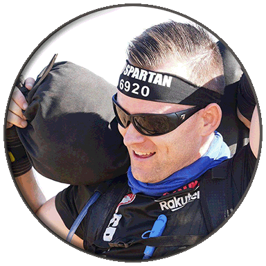

# UX Portfolio
I am Mike Harris, a now (yay) senior of Computer Science at CSU Chico. I'm a full time EMT-Basic on the Butte County ambulance, father of two, and looking to get out of the public safety sector. I'm ready to kick back and enjoy life, put in my 9-5, and go hunting or fishing on the weekends. One year is the only thing that stands in my way.

* **MAJOR**: Computer Science
* **UX**: No idea what UX is, so I'm interested in expanding my knowledge

## UX Team Project

## UX Journal

* [Journal Entry #1](journal-01/)
* [Journal Entry #2](journal02/)
