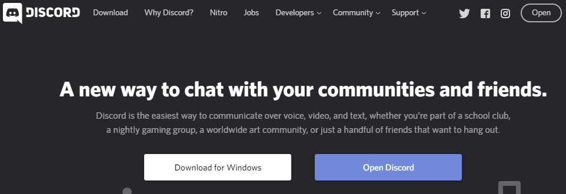
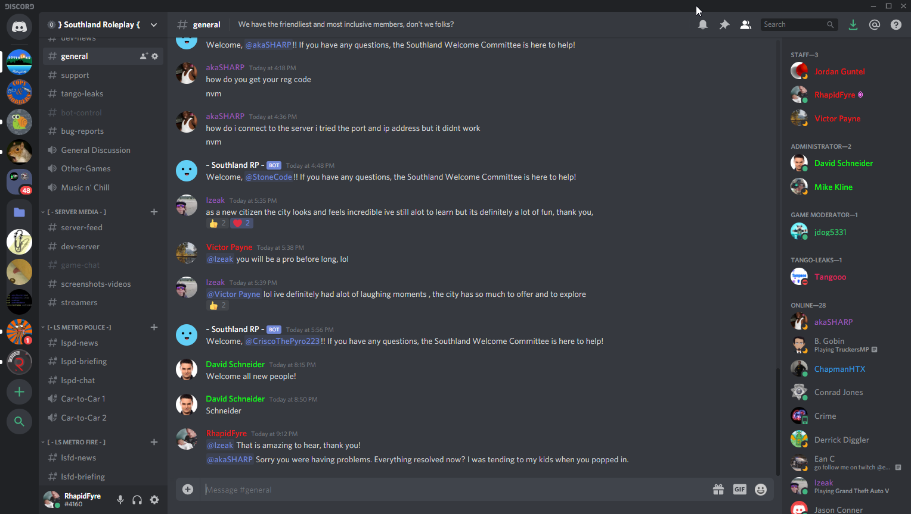

# Journal-Entry-02

## Discord - 
 

Thanks to the lockdowns, I've increased my use of Discord including both for school and personal matters. It's really come out to show it's power in handling the things it claims to do over the last month, even though I've seen its potential long before that. In this journal entry, we're going to look at Discord, examine it's positives and negatives, and how the technology serves us in today's world from all aspects: Gamer, student or non-gamer.

## What is Discord
Discord is a program that can be used either in a browser (original purpose), a desktop application, or a mobile application. It's a program that allows you to communicate with others via text or voice channels, based on your membership of a "server". A server is essentially a group on Discord that you have to be invited to join, or create yourself, hosted on Discord's cloud services. Once you're a member of a server, the owners and administrators of that server have set up channels that you can see & use based on the permissions they believe that each person should have. This can be as simple as a group of friends who have a basic Discord server to chat to each other when they're playing games, or as large as an entire computer science Discord server with tons of channels and a scripted computer program to assign permissions to people to see specific channels. Users can join and leave voice channels whenever they want, change their username for each Discord server, and change servers seamlessly just by clicking on a different server's icon. Last but not least, Discord goes so far as to even allow direct 1-to-1 voice calls where you can share screens and video call people on your friends list, or people you share membership in a server with.

## What Discord Does Right
I have been thoroughly impressed with Discord to the point that I have it on each of my devices, and use it daily. I use Discord for three purposes: Gaming, school and professional. I own my own Discord server for a community that I develop scripts for, I'm a member of numerous servers that I either play games on as well as a server I use for help with coursework, and I'm an administrator for a server that my in-person friends use to stay connected. This has given me a huge range of experience with Discord, not only limited to the basic chat and server features, but things such as automated scripts ("bots") that do as much as play music for you, welcome people who join your server, give you the daily news, report your server's status and errors.
 

* **Effective**: Discord is highly effective at solving the issue of having multiple chat programs for multiple groups, or multiple voice servers for various things. Whether you're a gamer, a small business, a gaming community, a school, a classroom or even co-workers in an office - Discord is very handy, lightweight, secure and even fun to use.
* **Learnable**: Discord's learning curve is very small. It's very easy to hop right in, join some servers (they use a universal language of signs and logos to get the point across) and registration is easy.
* **Useful**: Having Discord available on all common device platforms, multiple channels to use for voice & text, permissions based on membership and independent servers makes Discord extremely useful for just about anyone that has groups to communicate with. Being able to message and call people who aren't on your friends list but share a mutual server with you is also extremely useful.

## What Discord Does Wrong
It's hard to point out what Discord does wrong, but the two main things that stand out in my mind are the inability to have conference calls with video or screen sharing without setting up a message group outside of the server. For example, if me and 5 other group members used a voice channel on a Discord server, there's no way to video call or share screens. We would have to set up a side group via direct messaging to accomplish this. The second thing is that many user suggested features such as per-server profile pictures have been requested by thousands of users, yet the Discord development team seems to not notice or wish to implement these suggestions.
