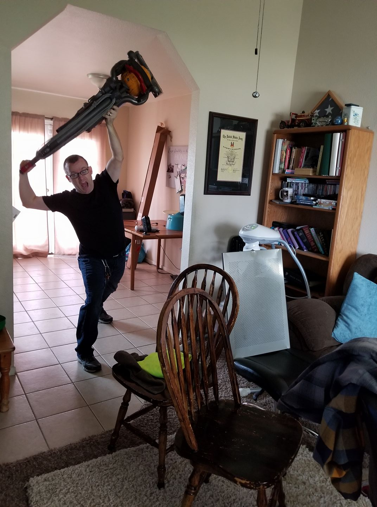

# The Dyson Ball Vacuum

### Introduction
---------------------
The Dyson Ball Vacuum is one of many of the awesome everyday technologies we use in our household. When it comes to the everyday requirement of suctioning dust and pet dander off of your indoor grass-like surfaces, you want something that is user friendly, effective and overall: usable. The idea between creating everyday devices is making it usable to the most amount of people as possible. The Dyson ball vacuum is such a device that I, or rather, my wife, uses every day. The increased mobility of the design over other vacuum cleaners is second to none, though what it exceeds in does cause fallback in some other areas. This journal entry will discuss the good and the bad of the unique design of the Dyson Ball. Yes, I am writing an article about a vacuum cleaner. It sucks.

When evaluating the usability of a vacuum, the main three things that stand out to me is the **effective**ness of the device being topmost of importance, followed by it’s **useful**ness and **learn**ability. While it’s important for a product to be safe, I highly doubt even a child would be able to harm themselves with a vacuum cleaner, so we’ll assume that all household variations of a suction device are safe. The Dyson Ball is a standard household vacuum, not a natural disaster flood water and pest control suctioning device.  

-----------------
#### Effective

The Dyson Ball is very effective at eliminating dust, pet dander, legos and other clutter as it's not only strong in it's performance, but it's unique design of using a rolling ball as a pivot point and also a drive gear is effective at getting into hard-to-reach places. Despite being a large plastic ball, it also works very well on hard surfaces such as title, though the effectiveness of a vacuum on a hard surface is by itself questionable. The design of the ball also has the unintended affect of further antagonizing any indoor dogs that already hate vacuum cleaners, and then have the natural tendency to want to play with the ball. This may have just been my experience with my dog, but the Dyson Ball was very effective at not only elimnating unwanted house dirt/grime, but entertaining (or terrifying) my dog.

---------------
#### Useful

While not as important as the effectiveness of a vacuum to perform it's intended purpose, a close second would be the usefulness of the design. Most vacuum cleaners by industry standard use a box-like bottom with four points of roller wheels which require the device to be manipulated around corners and hard to reach areas. The Dyson takes a quick flick of the wrist to cock it over to a weird angle like something out of the kama sutra, and you can cram the suction head underneath the side table behind the couch with minimal effort. Being manipulable and able to handle areas other vacuums cannot make the Dyson Ball stand out in usefulness.

------------
#### Learnable

It may seem like a stretch to write about learnability of a vacuum cleaner, but the more you look past the humor of this journal entry and into the actual nature of a vacuum, you realize that every vacuum bring with it a very frustrating aspect of two main things:
* 1) How in the world do you lower the arm so you can put the vacuum in mobile position, and
* 2) How do you detach the long hose so you can suction the cheetos out of the couch?

The Dyson Ball makes these two questions extremely easy to answer, making the device **learnable**, and unless you have dementia, **memorable**. The kick down release for putting the device into ready-position is easily noticable by a large red foot pedal that requires such little effort to depress that even my three year old could push it down, though I prefer stomping it like it's an accelerate to a 2020 Chevy Camaro ZL1 (just kidding, I don't do any of the cleaning in my house). This device also solves the 2nd question by marking the head of the detachable hose with a large red handle at the top with an arrow and a depiction of opening the handle to release the hose. Since we all speak differently languages, we can all agree that easy to decipher pictures make the device operable to a wider variety of customers.

------------------

All jokes aside, I actually enjoy this device. It's very effective at being a vacuum cleaner, and it's usefulness at reaching difficult locations that would otherwise require me to perform a three point turn in my living room is second to none.
